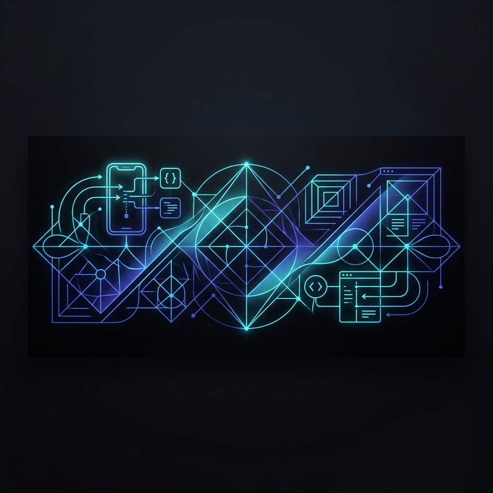

<!-- Profile README for Mir Borhan Uddin -->

<div align="center">
  

  <br/><br/>

  <h1>👋 Hi, I'm Mir Borhan Uddin</h1>
  <h3>Flutter Developer | Crafting Scalable & High-Performance Mobile Applications</h3>

  <p align="center">
    <a href="https://github.com/Borhan2004"></a>
    <a href="https://www.linkedin.com/in/mir-borhan-uddin-b78bb8350/"></a>
    <a href="mailto:borhankustia@gmail.com"></a>
  </p>
</div>

---

### 👨‍💻 About Me

I am a passionate **Flutter Developer** dedicated to building **fluid, highly performant, and scale-ready mobile experiences**. By leveraging clean architecture, modular state management, and intuitive UX/UI designs, I bridge the gap between complex requirements and pixel-perfect mobile applications.

* 🚀 **State Management:** Deep expertise in **GetX**, **Provider**, and state synchronization patterns.
* 🌱 **Continuous Learning:** Exploring custom paint animations, deep-level engine configurations, and slick iOS-native design patterns.
* ⚡ **Performance Geek:** Focused on minimizing build repaints, asset optimization, and lightning-fast REST API integrations.

---

### 📊 GitHub Statistics & Insights

<div align="center">
  <table border="0" cellpadding="10" cellspacing="0" width="100%">
    <tr>
      <td width="50%" align="center" valign="top">
        
      </td>
      <td width="50%" align="center" valign="top">
        
      </td>
    </tr>
  </table>
</div>

---

### 🛠️ Technical Toolkit

<table>
  <tr>
    <td valign="top" width="33%">
      <h4>📱 Mobile & Frontend</h4>
      <br/>
      <br/>
      <br/>
      <br/>
      
    </td>
    <td valign="top" width="33%">
      <h4>⚙️ Backend & Database</h4>
      <br/>
      <br/>
      
    </td>
    <td valign="top" width="33%">
      <h4>🛠️ Tools & Workflow</h4>
      <br/>
      <br/>
      <br/>
      
    </td>
  </tr>
</table>

---

### 💼 Professional Journey

```
┌────────────────────────────────────────────────────────┐
│  Flutter Developer @ Softvence Agency                   │
│  May 2025 - Present                                    │
│                                                        │
│  • Engineered cross-platform mobile apps with GetX.    │
│  • Designed robust API integrations and clean codebases.│
│  • Collaborated on custom performance tuning & UX.     │
└───────────────────────────┬────────────────────────────┘
                            ▼
┌────────────────────────────────────────────────────────┐
│  Marketing Executive @ Marcella Distribution Ltd      │
│  November 2024 - April 2025                            │
│                                                        │
│  • Directed targeted campaigns and engagement tracking. │
└───────────────────────────┬────────────────────────────┘
                            ▼
┌────────────────────────────────────────────────────────┐
│  Marketing Executive @ Remark HB Ltd                   │
│  January 2024 - November 2024                          │
│                                                        │
│  • Structured digital outreach and optimized growth.   │
└────────────────────────────────────────────────────────┘
```

---

### 🌐 Let's Build Something Amazing!

I am always open to discussing **Flutter architecture**, **mobile app projects**, or interesting open-source collaborations.

<p align="left">
  <a href="mailto:borhankustia@gmail.com">
    
  </a>
  <a href="https://www.linkedin.com/in/mir-borhan-uddin-b78bb8350/">
    
  </a>
  <a href="https://github.com/Borhan2004">
    
  </a>
</p>

---

<p align="center">
  <i>"Code is not just logic — it’s elegant, efficient, and crafted for impact."</i>
</p>
